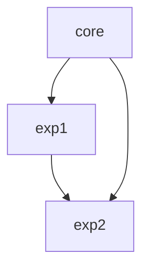

# A-Game-Theory-Perspective-on-IP-Routing-Protocols-Evaluation

## Paper Abstract

A non-cooperative game model is established in this paper for equilibrium analysis on common IP routing protocols, i.e., RIP, OSPF, IS-IS, and EIGRP, and the possible causes of non-equilibrium are demonstrated, such as the existence of the same link in the selected paths, and all the packets tending to avoid the link with a high delay. To improve routing, a method of decreasing the variance of routing basis between different links is proposed. Experimental results show that this method reduces the proportion of packets with non-minimized costs by 20% on average, and reduces the average actual cost per packet by 36%.

## Experiments Introduction

### Experiment I

In this experiment, the performances of the advanced distance-vector protocol and the improvement method are tested.

### Experiment II

Experiment II is based on Experiment I. In Experiment II, the influence of the number of packet groups in each round on the experiment is studied.

### Evaluation indexes

- The proportion of packets with non-minimized costs
- Average actual cost per packet
- Average optimal cost per packet

## Repo Files Introduction

- src: source codes
  - core.py: core codes
  - exp1.py: Experiment I codes
  - exp2.py: Experiment II codes
- res: results of experiments
- fig: figures of experiments

## Modules Architecture

Codes are in package `src` which includes three modules:



## Use Instruction

The results and figures of the two experiments in the paper have been saved in dir “res” and “fig”.

If you want to remake the figures, just run analyzeExp1Res() or analyzeExp2Res().

Only when you practice the experiments with new parameters, exp1() / exp2() with your parameters are needed to run before analyzeExp1Res() / analyzeExp2Res().

Use example:

```python
# clone repo and change dir to repo dir
# import modules
import src.exp1 as exp1
import src.exp2 as exp2

# Remake the figures
exp1.analyzeExp1Res()
exp2.analyzeExp2Res()
```

## Interfaces and Parameters

### Interfaces of exp1.py

- exp1(nTurns=100)

  Run Experiment I, and get results saved in dir “res”.

  Parameter:

  - nTurns: the number of experiment rounds, default as 100.

- analyzeExp1Res(nTurns=100)

  Analyze results of Experiment I, and get figures saved in dir “fig”.

  Parameter: same as exp1().

### Interfaces of exp2.py

- exp2(nPacketsMin=0, nPacketsMax=100, nPacketsStep=1, nTurns=100)

  Run Experiment II, and get results saved in dir “res”.

  Parameters:

  - nPacketsMin: lower bound of the number of packet groups.
  - nPacketsMax: upper bound of the number of packet groups.
  - nPacketsStep: sampling step size of the number of packet groups.
  - nTurns: number of experiment rounds per number of packet groups.

  Suggestions:

  - Large range of nPackets with small step size and large nTurns will make the experiment run a long time, e.g. 10 hours for the default parameters. Since nPackets=20 and 40 are the changing points, exp2(nPacketsMin=10, nPacketsMax=50, nPacketsStep=10, nTurns=20) is suggested.

- analyzeExp2Res(nPacketsMin=0, nPacketsMax=100, nPacketsStep=1)

  Analyze results of Experiment II, and get figures saved in dir “fig”.

  Parameters: same as those in exp2().

### Other parameters in codes

There are more parameters in source codes if you want to change the experiments more, mostly are in core.py.

- MESH_LEN: size of 2D mesh is MESH_LEN\*MESH_LEN.
- Parameters lowBandwidth and highBandwidth in getBandwidths(): lower and upper bounds of the normalized link bandwidth. Values are given when used in exp1() of exp1.py.

